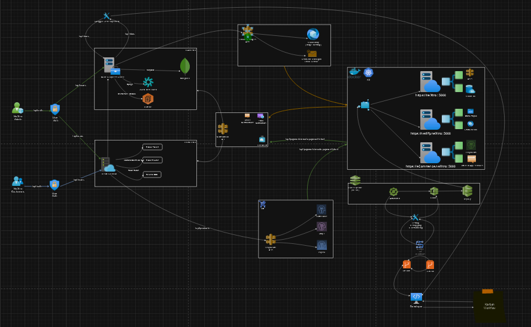

# 🛍️Webstack - Portfolio Project
MERN stack eCommerce web-based app for my ALX Software Engineering (Full Stack/ Backend) certification
<br></br>

### SETUP DEV ENVIRONMENT:
🛠️ Kanban, draw.io, GitHub & GitLab and deployment setup
<br></br>

### APP DEVELOPMENT & USER STORIES:
- 🔐 User auth (signup, login, JWT), basic UI
- 🛒 Product management (CRUD), with admin functionalities
- 🛍️ Shopping cart functionality, integrated with user profile management
- 💳 Checkout process, integrate with payment gateway
- 📦 Order management and user order history
- ⭐ Product reviews and ratings, including search and filtering
- 🧪 Testing, fix bugs, optimize performance (mainly Git Lab)
- 🚀📄 Final deployment, write documentation (Git Lab & Git Hub)
<br></br>

### PROJECT PRESENTATION:
📊 Project presentation, final review and adjustments (Google slide & Kanban Workflow)
<br></br>

# Repo/ Project Contents
## Web Infrastructure Diagram

<br></br>

## Developement Servers
To run the project's servers, first run the backend server, thereater, the frontend server:
- `backend`: use the following command at the root of <b>nextro-backend</b>

```bash
npm run dev
```
<br></br>
- `frontend`: use the following command at the root of <b>nextro-frontend</b>

```bash
npm start
```
<br></br>

## API Routes

| **Type**    | **Main Group**      | **Endpoint**                  | **Method** | **Description**                               | **Status Responses**     |
|-------------|---------------------|-------------------------------|------------|-----------------------------------------------|--------------------------|
| Frontend    | 🛍️ Product Details  | `/api/product-details`        | POST       | For signing up users                          | 200, 400, 409, 500       |
| Backend     | 🛍️ Products         | `router.post"/upload-product"`| POST       | Upload product                                | 200, 400, 500            |
| Backend     | 🛍️ Products         | `router.get"/get-product"`    | GET        | Get product details                           | 200, 400, 500            |
| Backend     | 🛍️ Products         | `router.post"/update-product"`| POST       | Update product                                | 200, 400, 409, 500       |
| Backend     | 🛍️ Products         | `router.get"/get-categoryProduct"` | GET   | Get products by category                      | 200, 400, 500            |
| Backend     | 🛍️ Products         | `router.post"/category-product"` | POST   | Get products by category                      | 200, 400, 500            |
| Backend     | 🛍️ Products         | `router.post"/product-details"` | POST    | Get product details                           | 200, 400, 500            |
| Backend     | 🛍️ Products         | `router.get"/search"`         | GET        | Search for a product                          | 200, 400, 500            |
| Backend     | 🛍️ Products         | `router.post"/filter-product"`| POST       | Filter products                               | 200, 400, 500            |
| Frontend    | 🛒 Cart              | `/api/addtocart`              | POST       | Add product to cart                           | 200, 400, 409, 500       |
| Frontend    | 🛒 Cart              | `/api/countAddToCartProduct`  | GET        | Get the count of products in the cart         | 200, 400, 500            |
| Frontend    | 🛒 Cart              | `/api/view-card-product`      | GET        | View products in the cart                     | 200, 400, 500            |
| Frontend    | 🛒 Cart              | `/api/update-cart-product`    | POST       | Update product in the cart                    | 200, 400, 409, 500       |
| Frontend    | 🛒 Cart              | `/api/delete-cart-product`    | POST       | Delete product from the cart                  | 200, 400, 409, 500       |
| Backend     | 🛒 Cart              | `router.post"/addtocart"`     | POST       | Add product to cart                           | 200, 400, 409, 500       |
| Backend     | 🛒 Cart              | `router.get"/countAddToCartProduct"` | GET | Get count of products in cart                 | 200, 400, 500            |
| Backend     | 🛒 Cart              | `router.get"/view-card-product"` | GET   | View products in cart                         | 200, 400, 500            |
| Backend     | 🛒 Cart              | `router.post"/update-cart-product"` | POST | Update product in cart                        | 200, 400, 409, 500       |
| Backend     | 🛒 Cart              | `router.post"/delete-cart-product"` | POST | Delete product from cart                      | 200, 400, 409, 500       |
| Frontend    | 🔍 Product Search    | `/api/search`                 | GET        | Search for a product                          | 200, 400, 500            |
| Frontend    | 🗂️ Product Filter    | `/api/filter-product`         | POST       | Filter products                               | 200, 400, 500            |
| Frontend    | 💳 Payment           | `/api/checkout`               | POST       | Payment processing                            | 200, 400, 500            |
| Backend     | 💳 Payment and Order | `router.post'/checkout'`      | POST       | Checkout                                      | 200, 400, 500            |
| Backend     | 💳 Payment and Order | `router.post'/webhook'`       | POST       | Payment webhook                               | 200, 400, 500            |
| Frontend    | 📦 Order             | `/api/order-list`             | GET        | Get user order list                           | 200, 400, 500            |
| Frontend    | 📦 Order             | `/api/all-order`              | GET        | Get all orders                                | 200, 400, 500            |
| Backend     | 💳 Payment and Order | `router.get"/order-list"`     | GET        | Get user order list                           | 200, 400, 500            |
| Backend     | 💳 Payment and Order | `router.get"/all-order"`      | GET        | Get all orders                                | 200, 400, 500            |
| Backend     | 🔐 Users             | `router.post"/signup"`        | POST       | Sign up users                                 | 200, 400, 409, 500       |
| Backend     | 🔐 Users             | `router.post"/signin"`        | POST       | Sign in users                                 | 200, 400, 401, 500       |
| Backend     | 🔐 Users             | `router.get"/user-details"`   | GET        | Get user details                              | 200, 400, 401, 500       |
| Backend     | 🔐 Users             | `router.get"/userLogout"`     | GET        | Log out users                                 | 200, 400, 401, 500       |
| Backend     | 🛠️ Admin Panel       | `router.get"/all-user"`       | GET        | Get all users                                 | 200, 400, 401, 500       |
| Backend     | 🛠️ Admin Panel       | `router.post"/update-user"`   | POST       | Update user details                           | 200, 400, 401, 409, 500  |
<br></br>

# Research References Used
## API Development
- https://github.com/APIDevTools/swagger-express-middleware/issues/161#issue-553305427
